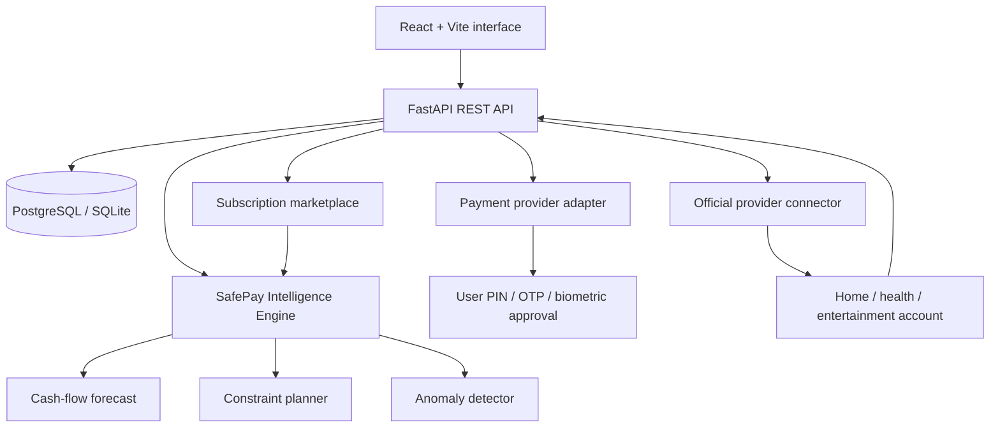

# BillFlow AI

**An explainable personal-finance operating system and secure, all-in-one bill-payment orchestrator.**

BillFlow AI unifies utilities, subscriptions, EMIs, insurance, rent, education fees and recharges. Its **SafePay Intelligence Engine** forecasts daily liquidity, identifies unusual spending and recommends a payment date and funding source while respecting a user-defined reserve. A recommendation never moves money: every payment must cross a separate provider authorization boundary.

It also includes a provider synchronization layer. A linked application remains the source of truth: BillFlow imports its obligation, pays against the exact external customer and bill reference, records the settlement confirmation, and synchronizes the provider account to states such as **due cleared**, **subscription active** or **renewed**.

## Why it is more than an expense tracker

Most finance dashboards describe past transactions. BillFlow AI turns future obligations into an accountable decision plan:

1. **Cash-flow simulation** combines balances, upcoming obligations, stated income and observed discretionary spending.
2. **Constraint-aware planning** schedules bills before their due dates without intentionally crossing the user's safety reserve.
3. **Payment-source ranking** considers available balance, reserve protection and configured reward rates.
4. **Robust anomaly detection** uses category-level median absolute deviation instead of treating every large purchase as fraud.
5. **Explainability** reports the selected date, account, policy, confidence and reason for each recommendation.
6. **Human authorization** separates AI advice from payment execution and records every state change in an audit trail.

The research direction is an **Explainable Multi-Objective Payment Orchestration System Under Cash-Flow Uncertainty**. A publishable evaluation would compare SafePay against due-date-only, earliest-payment and reward-only baselines using late-payment rate, reserve violations, failed payments, saved fees/rewards and explanation usefulness.

## Current working vertical slice

- Animated, responsive landing page with registration-first onboarding
- Email/password JWT authentication and optional Google OAuth
- Financial accounts, transactions and bill management
- Utility, subscription, EMI, insurance, recharge, rent and education categories
- Two-stage sandbox payment flow: prepare → explicit authorization
- Downloadable PDF receipt after a successful sandbox payment
- Connected-app catalog for home, health and entertainment accounts
- **Browse Apps** subscription marketplace with complete plan, feature, limit, trial, cancellation and refund details
- Personalized **Subscribe / Wait / Do not subscribe** decisions for every plan
- Interaction memory for viewed, shortlisted, dismissed, intended, activated and cancelled plans
- Affordability-first ranking using balance, reserve, 45-day cash flow, recurring commitments and competing deadlines
- Warning acknowledgement before an AI-cautioned plan can become a payable bill
- External customer-ID mapping and provider-sourced bill import
- Post-payment due clearance, coverage activation and subscription activation/renewal
- Provider settlement confirmations, synchronization states and reconciliation events
- Idempotent payment creation and immutable-style audit events
- 7–90 day cash-flow forecast
- Financial-health score with visible component breakdown
- Explainable SafePay plan and robust anomaly flags
- Demo data generator, API documentation and automated tests
- SQLite for instant local development; PostgreSQL through Docker Compose

## Architecture



The repository currently uses a sandbox provider. Production connectors must use each provider's supported OAuth/API flow. BillFlow must never store bank passwords, UPI PINs, OTPs or biometric secrets.

## External-provider lifecycle

1. The user connects a provider account using its official OAuth flow or supported customer reference.
2. BillFlow calls the provider's inquiry API and imports the real bill, invoice, plan or renewal.
3. SafePay recommends a date and payment source, but the user still authorizes the payment.
4. BillFlow sends the external customer/bill reference through the approved gateway or bill-payment network.
5. A verified settlement webhook or status-inquiry response confirms the payment.
6. The connector re-queries the provider and stores the source-of-truth state: `cleared`, `active`, `renewed`, `past_due` or `cancelled`.
7. A reconciliation event and provider confirmation ID remain visible in the audit trail.

The included `GridHome Energy`, `MediCare Health` and `StreamPlus` connectors are deterministic sandboxes that demonstrate this entire lifecycle. The catalog also exposes the production Bharat Connect/BBPS route as disabled until approved partner credentials and certificates are supplied. BillFlow never presents a sandbox state as a real third-party update.

## Browse Apps and subscription decisions

The **Browse Apps** workspace currently contains five fictional demonstration applications: `StreamPlus`, `MusicWave`, `CloudBox`, `FitPulse` and `LearnPro`. Opening an application reveals every cataloged plan, including its upfront and monthly-equivalent cost, billing cycle, trial, features, usage limits, auto-renewal behavior, cancellation terms and refund policy.

For each plan, SafePay returns one of three explicit decisions:

- **Subscribe** — the modeled 45-day low remains above the configured reserve and the recurring cost is proportionate.
- **Wait** — the plan is not immediately dangerous, but the reserve or nearby bill deadlines make timing unfavorable.
- **Do not subscribe** — the plan duplicates an active plan or materially risks a negative cash-flow projection.

The explanation exposes the projected low balance, reserve gap, income share, active subscriptions, conflicting bill deadlines, preference signal, reasons, risks and data confidence. Views, shortlists and dismissals personalize fit, but affordability is evaluated first and cannot be overridden by engagement history. A user may acknowledge a warning and create the bill, preserving human control; the service still remains inactive until the separate payment-authorization step succeeds.

Catalog names, prices and provider updates in this repository are deterministic sandbox data, not claims about real commercial services. Production catalogs must be obtained from official provider APIs or approved commercial feeds and refreshed under their terms.

## Run locally

### 1. Backend

```powershell
cd backend
py -m venv .venv
.venv\Scripts\Activate.ps1
pip install -r requirements.txt
Copy-Item .env.example .env
uvicorn app.main:app --reload --port 8000
```

Open API documentation at `http://localhost:8000/docs`.

### 2. Frontend

In a second PowerShell window:

```powershell
cd frontend
npm install
npm run dev
```

Open `http://localhost:5173`, register, and choose **Load secure demo data** on the dashboard. Open **Browse apps** to compare plans and inspect the personalized recommendation, or **Connected apps** to inspect imported provider states. Choosing a subscription creates a bill; paying it from **Bills & pay** activates the exact sandbox plan and records its provider confirmation.

### Docker alternative

```powershell
docker compose up --build
```

### Tests

```powershell
cd backend
pytest -q
```

## Google OAuth

Create a Google OAuth **Web application** client and register this exact redirect URI:

```text
http://localhost:8000/api/v1/auth/google/callback
```

Then set `GOOGLE_CLIENT_ID` and `GOOGLE_CLIENT_SECRET` in `backend/.env`. Google identity is exchanged for BillFlow's own authenticated session; it does not grant access to unrelated financial providers.

## Production work still required

The sandbox deliberately does not claim to be a bank or universal payment rail. A production launch additionally requires a licensed payment/Bharat Connect partner, separate commercial/API access for every supported service, provider-specific OAuth consent, token encryption/KMS, migrations, background retries and notifications, reconciliation, webhook-signature verification, rate limiting, secrets management, monitoring, privacy/retention controls, regulatory and security review, and deployment-specific HTTPS/cookie settings. Providers without a supported API can only use a user-assisted handoff or remain local-only; BillFlow cannot silently edit arbitrary third-party accounts.

## License

MIT
