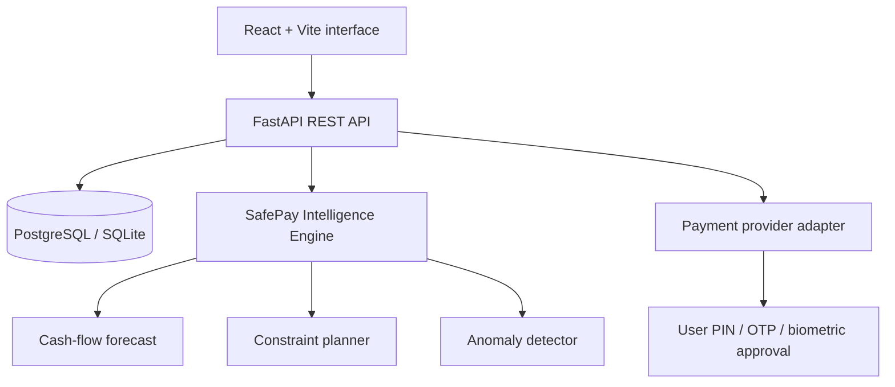

# BillFlow AI

**An explainable personal-finance operating system and secure, all-in-one bill-payment orchestrator.**

BillFlow AI unifies utilities, subscriptions, EMIs, insurance, rent, education fees and recharges. Its **SafePay Intelligence Engine** forecasts daily liquidity, identifies unusual spending and recommends a payment date and funding source while respecting a user-defined reserve. A recommendation never moves money: every payment must cross a separate provider authorization boundary.

## Why it is more than an expense tracker

Most finance dashboards describe past transactions. BillFlow AI turns future obligations into an accountable decision plan:

1. **Cash-flow simulation** combines balances, upcoming obligations, stated income and observed discretionary spending.
2. **Constraint-aware planning** schedules bills before their due dates without intentionally crossing the user's safety reserve.
3. **Payment-source ranking** considers available balance, reserve protection and configured reward rates.
4. **Robust anomaly detection** uses category-level median absolute deviation instead of treating every large purchase as fraud.
5. **Explainability** reports the selected date, account, policy, confidence and reason for each recommendation.
6. **Human authorization** separates AI advice from payment execution and records every state change in an audit trail.

The research direction is an **Explainable Multi-Objective Payment Orchestration System Under Cash-Flow Uncertainty**. A publishable evaluation would compare SafePay against due-date-only, earliest-payment and reward-only baselines using late-payment rate, reserve violations, failed payments, saved fees/rewards and explanation usefulness.

## Current working vertical slice

- Animated, responsive landing page with registration-first onboarding
- Email/password JWT authentication and optional Google OAuth
- Financial accounts, transactions and bill management
- Utility, subscription, EMI, insurance, recharge, rent and education categories
- Two-stage sandbox payment flow: prepare → explicit authorization
- Downloadable PDF receipt after a successful sandbox payment
- Idempotent payment creation and immutable-style audit events
- 7–90 day cash-flow forecast
- Financial-health score with visible component breakdown
- Explainable SafePay plan and robust anomaly flags
- Demo data generator, API documentation and automated tests
- SQLite for instant local development; PostgreSQL through Docker Compose

## Architecture



The repository currently uses a sandbox provider. Production connectors must use each provider's supported OAuth/API flow. BillFlow must never store bank passwords, UPI PINs, OTPs or biometric secrets.

## Run locally

### 1. Backend

```powershell
cd backend
py -m venv .venv
.venv\Scripts\Activate.ps1
pip install -r requirements.txt
Copy-Item .env.example .env
uvicorn app.main:app --reload --port 8000
```

Open API documentation at `http://localhost:8000/docs`.

### 2. Frontend

In a second PowerShell window:

```powershell
cd frontend
npm install
npm run dev
```

Open `http://localhost:5173`, register, and choose **Load secure demo data** on the dashboard.

### Docker alternative

```powershell
docker compose up --build
```

### Tests

```powershell
cd backend
pytest -q
```

## Google OAuth

Create a Google OAuth **Web application** client and register this exact redirect URI:

```text
http://localhost:8000/api/v1/auth/google/callback
```

Then set `GOOGLE_CLIENT_ID` and `GOOGLE_CLIENT_SECRET` in `backend/.env`. Google identity is exchanged for BillFlow's own authenticated session; it does not grant access to unrelated financial providers.

## Production work still required

The sandbox deliberately does not claim to be a bank or universal payment rail. A production launch additionally requires a licensed payment partner, provider-specific OAuth consent, token encryption/KMS, migrations, background retries and notifications, reconciliation, webhook-signature verification, rate limiting, secrets management, monitoring, privacy/retention controls, regulatory and security review, and deployment-specific HTTPS/cookie settings.

## License

MIT
